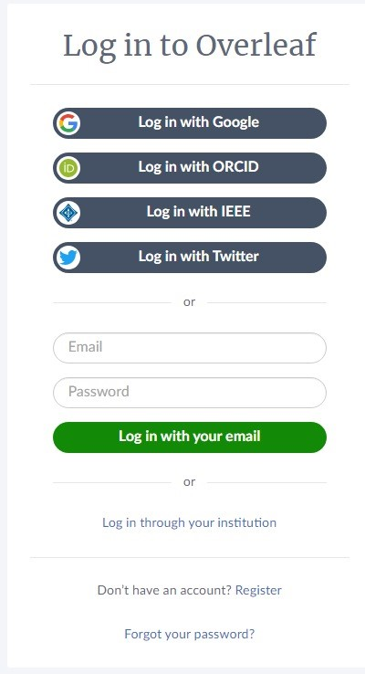
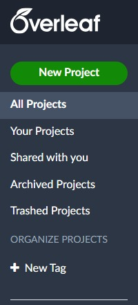
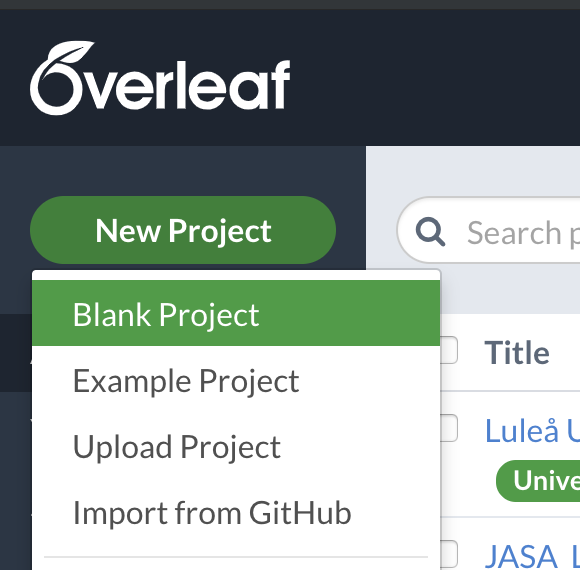
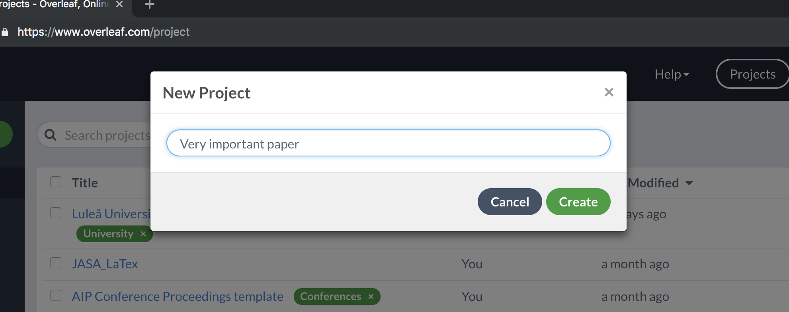
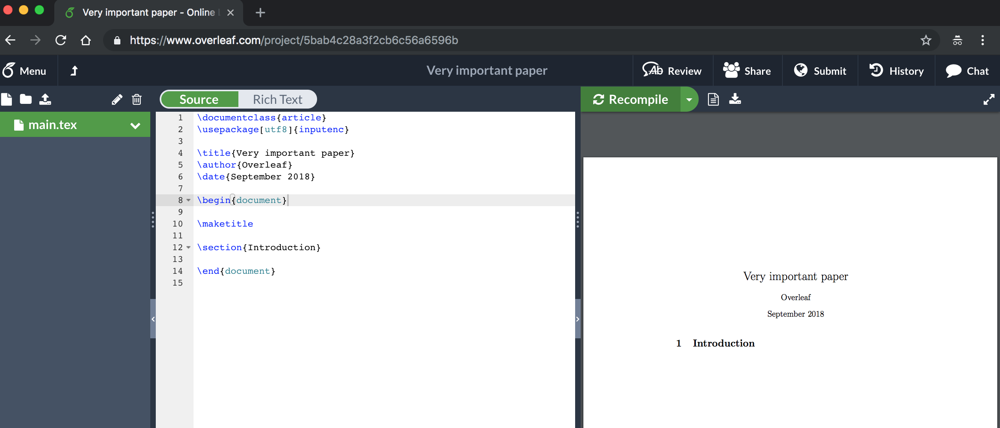
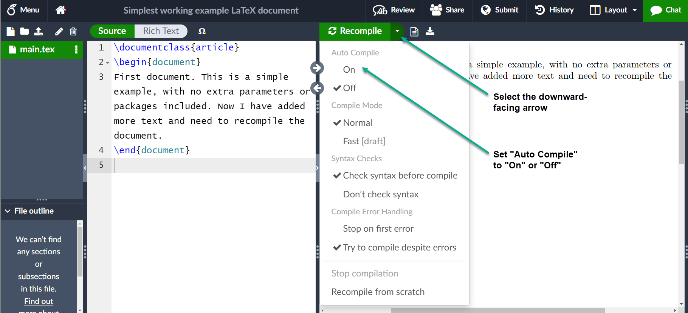

# Creating a document in Overleaf

## Contents

1. Introduction 
2. Starting a new Project
3. Creating your First LaTeX document.
4. Further Reading

### 1. Introduction

To start using Overleaf go to www.overleaf.com.

* Create account using your Gmail, Orcid id or whatever paltform available at the website.
* Set the password that you desire.
* Click Regsiter

### 2. Starting a new Project 

##### To start from the scratch, click on the "New Project" agter you sign up using your email.

**You will see the dropdown menu**

* Click **New Project** then select $\rightarrow$ **Blank Project**.

A box will open so you can name the title of your project. Then click **Create**.

* Now you are being redirected to the Overleaf editor

### 3. Creating your First LaTeX document.

To create a document in LaTeX, 
* Start by defining a class of the document e.g article, report, book \newline

* For article documentation, write
1. **\documentclass{article}** 
* \begin{document}

  \end{document}

**Add the content you want to fill in the begin{document} enviornment**

* Press the recompile button to see the content you have written in the parallel windown below the recompile button in pdf format
